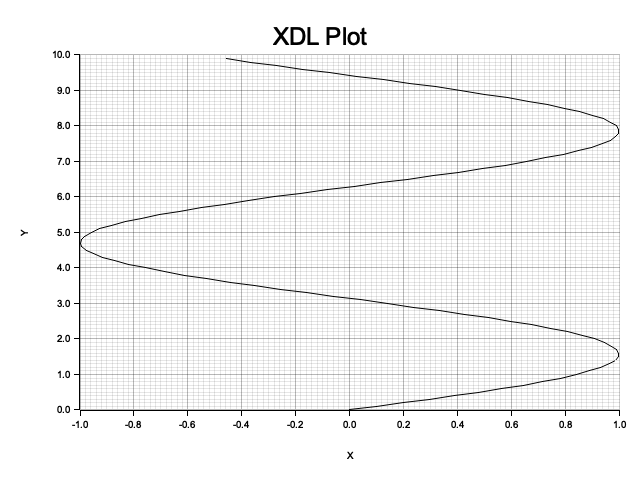
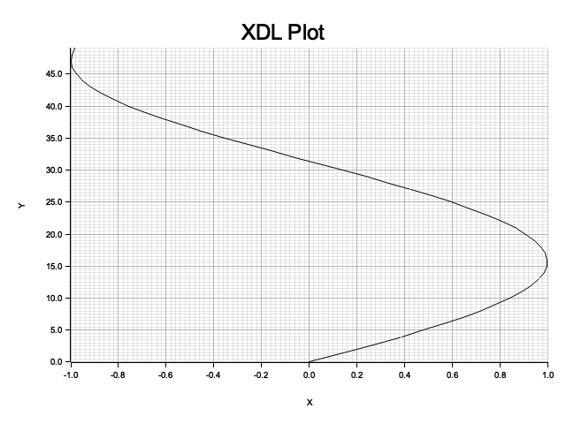
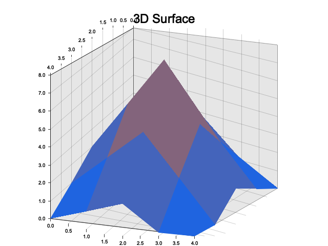
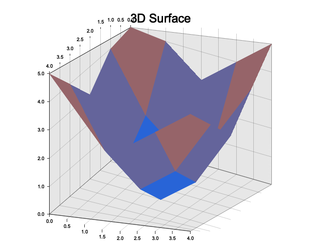
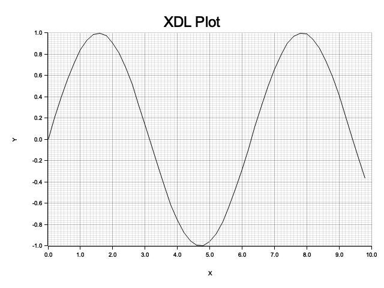

# Examples Gallery

This gallery showcases visual output from XDL examples, demonstrating the plotting and visualization capabilities.

## 📊 2D Plotting Examples

### Basic Plotting

*Basic plotting with XDL - showing fundamental plotting capabilities*


*Trigonometric functions visualization*


*Sine and cosine wave plotting*

### Advanced Plotting

*Mathematical function plotting demonstration*


*Advanced mathematical visualizations*


*Sample script plotting example*

## 📈 Surface and Contour Plots

### Surface Plots

*Bezier surface visualization*


*Mandelbrot set surface plot*


*Surface plotting demonstration*

### Contour Plots

*Contour plot visualization*


*3D plotting contour view*

## 🎨 3D Visualization

### 3D Surface Plots

*3D surface visualization*


*Shaded surface rendering*

### 3D Line Plots

*3D line plotting*

## 📋 Simple Examples

### Basic Demos

*Basic plotting demonstration*


*Working plot example*


*Simple plotting test*

## 📁 Example Categories

The examples are organized into the following categories:

- **Basics**: Fundamental XDL concepts and operations
- **Plotting**: 2D plotting and visualization
- **Visualization 3D**: 3D rendering and volume visualization
- **Machine Learning**: ML algorithms and data processing
- **Scientific**: Advanced scientific computing examples
- **MATLAB**: MATLAB/Octave compatibility examples
- **Tests Working**: Working test examples
- **Tests Failing**: Examples that need fixes

## 🚀 Running Examples

To run any of these examples yourself:

```bash
# Run an XDL example
xdl examples/xdl/01_hello_world.xdl

# Run a plotting example
xdl examples/xdl/03_plotting_basics.xdl

# Check organized examples
ls examples_organized/
```

## 📊 Statistics

- **Total Examples**: 152 files (.xdl, .pro, .m)
- **Working Examples**: 44 (execute successfully)
- **Failing Examples**: 31 (need fixes or dependencies)
- **Visual Examples**: 22 (generate plots/visualizations)
- **Generated Images**: 18 images from 12 examples

## 🔧 Technical Details

Images are automatically generated by running the visual examples and capturing their output. The plotting system supports:

- 2D line plots with customizable titles and axis labels
- Surface plots for 3D data visualization
- Contour plots for topographic data
- 3D line plots and surface rendering
- PNG image export for documentation

All images are generated using XDL's built-in graphics capabilities and saved as high-quality PNG files for clear documentation presentation.